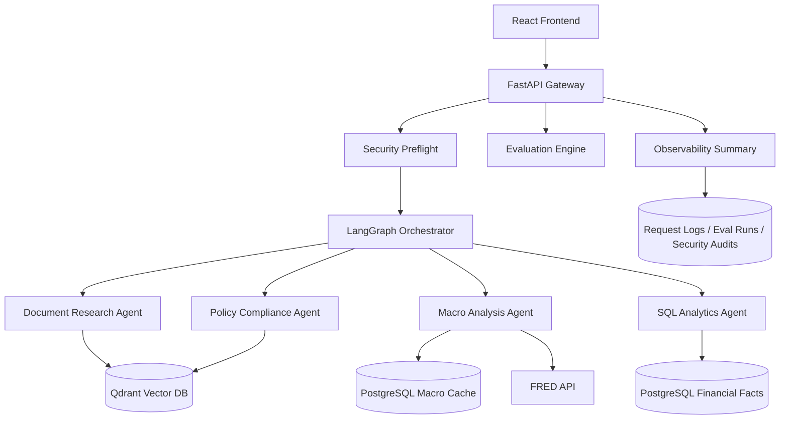
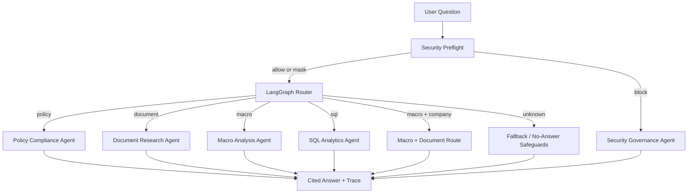
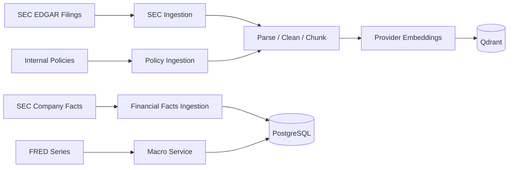
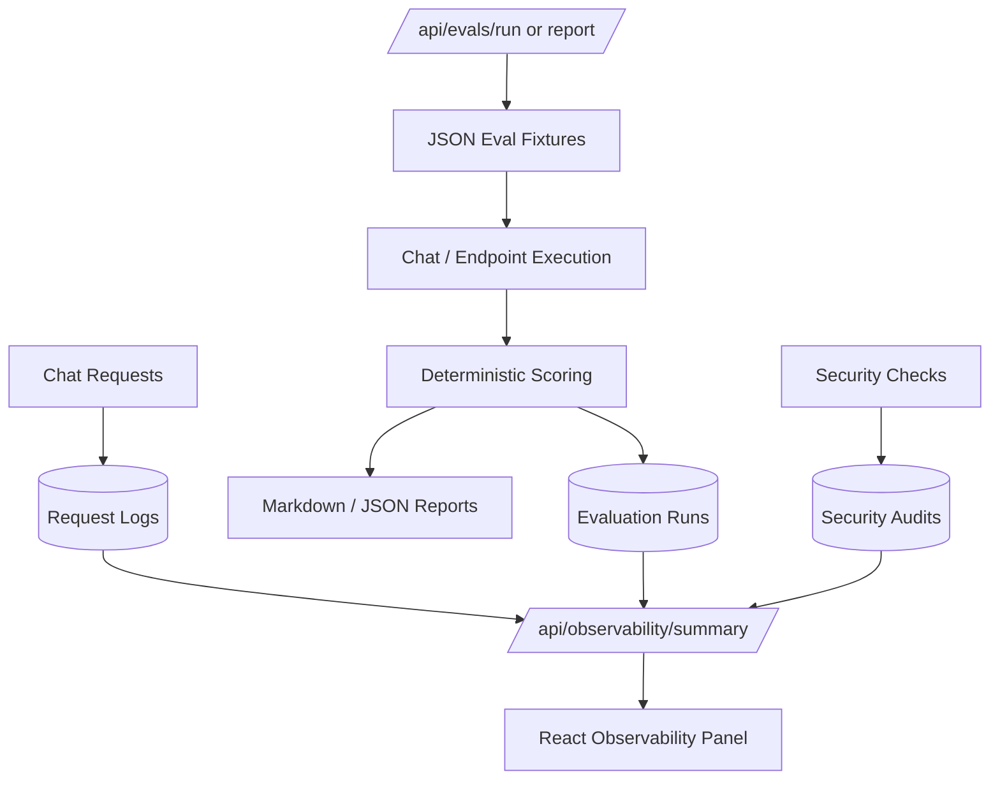

# Architecture Pack

## Executive Summary

Aurelia Ledger is an enterprise financial intelligence platform that simulates how a financial services firm could combine document research, macroeconomic analysis, structured financial analytics, policy compliance, security guardrails, evaluation, and observability into one AI-assisted research workflow.

The project is designed to demonstrate two complementary capabilities:

- Senior AI Engineer: building reliable RAG, data ingestion, agent routing, deterministic evaluation, and production-style APIs.
- AI Solution Architect: connecting business goals, governance, risk controls, deployment planning, cost control, and operational monitoring.

## Business Context

Financial research and operations teams often need to answer questions that cross multiple data sources:

- SEC filings for company disclosures and risk factors.
- FRED macro data for economic context.
- SEC Company Facts for structured financial metrics.
- Internal policies for compliance and governance checks.

The platform models an internal assistant for research analysts, compliance reviewers, and operations teams. The system is intentionally traceable: responses include sources, route decisions, latency, and evaluation evidence.

## Current Capabilities

- Document Research Agent for SEC filings and policy RAG.
- Macro Analysis Agent for FRED or deterministic sample macro data.
- SQL Analytics Agent for safe structured financial facts.
- Policy Compliance Agent for internal governance documents.
- LangGraph Workflow Orchestrator for deterministic agent routing.
- Security preflight for PII masking and prompt injection blocking.
- Evaluation Engine with deterministic scoring and reports.
- Observability Dashboard over request logs, evaluation runs, and security audits.

## High-Level Architecture

## Agent Workflow

## Data Flow

## Evaluation And Observability Flow

## Key Design Decisions

| Decision | Rationale | Tradeoff |
| --- | --- | --- |
| Deterministic routing before LLM routing | Repeatable, low cost, easy to evaluate | Less flexible than LLM-based intent classification |
| Provider embeddings with Qdrant | Persistent vector search and realistic RAG architecture | Requires embedding configuration and collection management |
| Safe SQL templates only | Avoids SQL injection and unstable generated SQL | Less flexible than free-form analytics questions |
| Deterministic evaluation | No LLM judge cost, predictable CI behavior | Only a proxy for semantic quality |
| Security preflight before routing | Prevents risky requests from reaching tools | Rule-based detection will miss some attacks |
| Custom observability dashboard | Fast portfolio value using existing PostgreSQL logs | Less comprehensive than Prometheus/Grafana |

## Production Gaps

- Authentication and RBAC are not fully implemented.
- LLM answer generation is intentionally limited in several paths to reduce cost and hallucination risk.
- Evaluation uses deterministic checks rather than human or LLM-as-judge review.
- Observability is stored in PostgreSQL, not a dedicated metrics backend.
- No Alembic migration framework is included yet.

## Recommended Next Architecture Steps

- Add SSO and role-aware access policies.
- Add formal migration management.
- Add batch ingestion jobs and retry queues.
- Add model fallback and provider health checks.
- Add Prometheus metrics for production deployment.
- Add human approval workflow for external research distribution.
