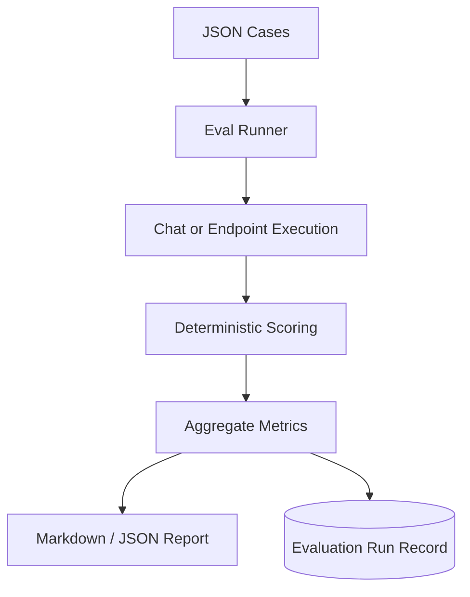

# Evaluation Engine

## Definition

The Evaluation Engine runs deterministic test cases against chat and endpoint behavior, then scores route accuracy, source coverage, citations, answer terms, latency, and hallucination-risk flags.

## Why It Exists In Aurelia Ledger

AI systems need measurable quality signals. The project uses deterministic evaluation to provide repeatable portfolio evidence without LLM judge cost.

## Implementation Links

| Area | File | Lines | Why It Matters |
| --- | --- | --- | --- |
| Evaluation entrypoints | [eval_service.py](https://github.com/WWIIITT/enterprise-financial-intelligence-agent/blob/main/backend/app/services/eval_service.py#L27-L55) | L27-L55 | Runs suites and generates reports |
| Case loading and execution | [eval_service.py](https://github.com/WWIIITT/enterprise-financial-intelligence-agent/blob/main/backend/app/services/eval_service.py#L56-L138) | L56-L138 | Loads JSON fixtures and executes cases |
| Scoring functions | [eval_service.py](https://github.com/WWIIITT/enterprise-financial-intelligence-agent/blob/main/backend/app/services/eval_service.py#L139-L248) | L139-L248 | Scores route, sources, citations, terms, latency, trace, and schema |
| Metric aggregation | [eval_service.py](https://github.com/WWIIITT/enterprise-financial-intelligence-agent/blob/main/backend/app/services/eval_service.py#L249-L283) | L249-L283 | Computes pass rate, averages, and p95 latency |
| Report writing | [eval_service.py](https://github.com/WWIIITT/enterprise-financial-intelligence-agent/blob/main/backend/app/services/eval_service.py#L284-L344) | L284-L344 | Builds markdown / JSON reports and records runs |
| Eval fixtures | [backend/app/evals](https://github.com/WWIIITT/enterprise-financial-intelligence-agent/tree/main/backend/app/evals) | Directory | Defines SEC, macro, SQL, orchestrator, security, and observability suites |

## Core Workflow



## Technical Deep Dive

The engine evaluates behavior through explicit expectations:

- expected agent route
- required source type
- required citation terms
- required answer terms
- forbidden answer terms
- minimum source count
- expected trace steps

This does not replace human evaluation. It creates a stable baseline that can run locally or in CI.

## Formula / Scoring Model

Pass rate:

```text
pass_rate = cases_passed / cases_total
```

Route accuracy:

```text
route_accuracy = route_passed_cases / cases_with_expected_agent
```

Source coverage:

```text
source_coverage = cases_with_required_sources_passed / cases_with_required_sources
```

P95 latency:

```text
p95 = sorted(latencies)[ceil(0.95 * n) - 1]
```

## Example Walkthrough

Request:

```json
{ "suite": "all" }
```

Expected behavior:

1. Load all eval fixture files.
2. Run each case against chat or service endpoint.
3. Score route, source, citation, answer, latency, and trace checks.
4. Return aggregate metrics.
5. Optionally write markdown and JSON reports.

## Design Tradeoffs

- Deterministic checks are cheap and repeatable.
- They can be brittle if wording changes.
- They are a quality proxy, not a full semantic judge.

## Failure Modes

- Required terms may miss valid paraphrases.
- Test fixtures can become stale.
- Passing smoke tests does not guarantee production reliability.

## Exercises

1. Checkpoint:
   Explain the difference between route accuracy and answer faithfulness.

2. Hands-on:
   Inspect [eval_service.py L139-L248](https://github.com/WWIIITT/enterprise-financial-intelligence-agent/blob/main/backend/app/services/eval_service.py#L139-L248) and identify which checks can fail a case.

3. Interview Drill:
   Explain why deterministic evaluation is a good first step before adding LLM-as-judge.

## Interview Explanation

The Evaluation Engine turns agent behavior into measurable evidence. It supports portfolio review because the system can show quality metrics, not only screenshots.
