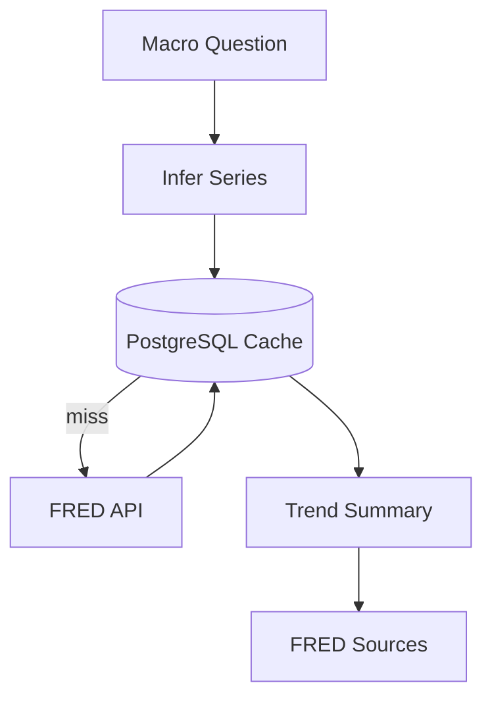

# FRED Macro Agent

## Definition

The FRED Macro Agent loads macroeconomic time series, caches observations, summarizes trends, and cites the economic series used in an answer.

## Why It Exists In Aurelia Ledger

Company risk is not isolated from the macro environment. Interest rates, inflation, unemployment, GDP, and treasury yields can affect valuation, demand, financing cost, and investor risk appetite.

## Implementation Links

| Area | File | Lines | Why It Matters |
| --- | --- | --- | --- |
| Series catalog and sample data | [macro_service.py](https://github.com/WWIIITT/enterprise-financial-intelligence-agent/blob/main/backend/app/services/macro_service.py#L18-L61) | L18-L61 | Defines supported FRED series and deterministic fallback |
| FRED client | [macro_service.py](https://github.com/WWIIITT/enterprise-financial-intelligence-agent/blob/main/backend/app/services/macro_service.py#L62-L123) | L62-L123 | Fetches metadata and observations |
| Series and analysis APIs | [macro_service.py](https://github.com/WWIIITT/enterprise-financial-intelligence-agent/blob/main/backend/app/services/macro_service.py#L124-L187) | L124-L187 | Builds macro responses and analysis summaries |
| Macro intent detection | [macro_service.py](https://github.com/WWIIITT/enterprise-financial-intelligence-agent/blob/main/backend/app/services/macro_service.py#L188-L223) | L188-L223 | Detects macro questions and infers series |
| Cache and summary helpers | [macro_service.py](https://github.com/WWIIITT/enterprise-financial-intelligence-agent/blob/main/backend/app/services/macro_service.py#L252-L392) | L252-L392 | Loads cache, saves observations, computes trend labels |
| Macro eval cases | [macro_cases.json](https://github.com/WWIIITT/enterprise-financial-intelligence-agent/blob/main/backend/app/evals/macro_cases.json) | Full file | Validates macro routing and summaries |

## Core Workflow



## Technical Deep Dive

The macro module supports live FRED data and deterministic sample fallback. This makes the demo reliable even without a FRED key, while still allowing production-style live data when configured.

The agent summarizes each series using the latest observation and a simple recent trend label. It can also compose company-risk linkage text for questions that mention both macro conditions and a company.

## Formula / Scoring Model

Latest observation:

```text
latest = observations sorted by date descending [0]
```

Simple trend:

```text
trend = up      if latest_value > earliest_recent_value
trend = down    if latest_value < earliest_recent_value
trend = flat    otherwise
```

Percent change:

```text
percent_change = ((latest - previous) / abs(previous)) * 100
```

## Example Walkthrough

Question:

```text
How do current rates and inflation affect Apple risk?
```

Expected behavior:

1. Infer `FEDFUNDS`, `CPIAUCSL`, and possibly `UNRATE`.
2. Load from cache or FRED.
3. Summarize latest values and trends.
4. Link rates and inflation to demand, discount rates, and valuation risk.
5. Cite FRED series sources.

## Design Tradeoffs

- Deterministic summaries avoid additional LLM cost.
- Sample fallback keeps tests and demos stable.
- Trend logic is simple and transparent, not a full macro model.

## Failure Modes

- FRED key missing or invalid.
- FRED endpoint unavailable.
- Cached data stale.
- Macro linkage text becomes too generic without company evidence.

## Exercises

1. Checkpoint:
   Explain why macro context matters for company risk analysis.

2. Hands-on:
   Inspect [macro_service.py L347-L369](https://github.com/WWIIITT/enterprise-financial-intelligence-agent/blob/main/backend/app/services/macro_service.py#L347-L369) and describe how trend labels are generated.

3. Interview Drill:
   Explain why deterministic sample fallback is useful for demos and tests.

## Interview Explanation

The Macro Agent shows multi-source reasoning: a financial answer can combine company-specific disclosures with economic context.
