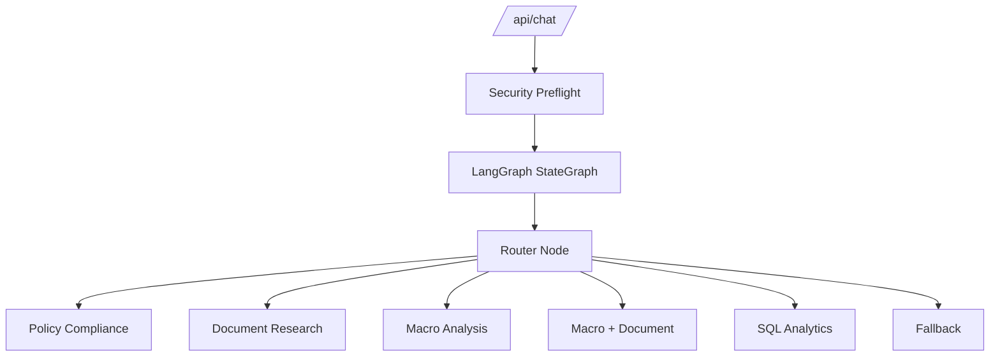

# LangGraph Orchestrator

## Definition

The LangGraph Orchestrator is the workflow layer behind `/api/chat`. It runs security preflight, selects an agent route, executes the selected node, and returns a stable `ChatResponse`.

## Why It Exists In Aurelia Ledger

The platform has multiple tools and agents. Routing logic must be explicit, testable, and visible in traces. LangGraph provides a clean workflow structure without changing the public API.

## Implementation Links

| Area | File | Lines | Why It Matters |
| --- | --- | --- | --- |
| Orchestrator state and entrypoint | [orchestrator.py](https://github.com/WWIIITT/enterprise-financial-intelligence-agent/blob/main/backend/app/agents/orchestrator.py#L19-L67) | L19-L67 | Defines state and wraps the graph execution |
| Route decision | [orchestrator.py](https://github.com/WWIIITT/enterprise-financial-intelligence-agent/blob/main/backend/app/agents/orchestrator.py#L68-L82) | L68-L82 | Selects policy, document, macro, macro-document, SQL, or fallback |
| Graph construction | [orchestrator.py](https://github.com/WWIIITT/enterprise-financial-intelligence-agent/blob/main/backend/app/agents/orchestrator.py#L83-L120) | L83-L120 | Builds the LangGraph nodes and conditional edges |
| Agent nodes | [orchestrator.py](https://github.com/WWIIITT/enterprise-financial-intelligence-agent/blob/main/backend/app/agents/orchestrator.py#L121-L231) | L121-L231 | Executes policy, document, macro, hybrid, SQL, and fallback routes |
| Response assembly | [orchestrator.py](https://github.com/WWIIITT/enterprise-financial-intelligence-agent/blob/main/backend/app/agents/orchestrator.py#L232-L257) | L232-L257 | Preserves response shape and metrics |
| Route tests | [test_orchestrator.py](https://github.com/WWIIITT/enterprise-financial-intelligence-agent/blob/main/backend/tests/test_orchestrator.py) | Full file | Validates route decisions and traces |

## Core Workflow



## Technical Deep Dive

The router is deterministic. It inspects the message for policy, document, macro, and SQL intent. This choice keeps routing low cost and makes evaluation stable.

The orchestrator is not used to hide complexity. It exposes complexity through trace steps such as `security_preflight`, `route`, selected agent execution, and `respond`.

## Formula / Scoring Model

Route decision matrix:

```text
if sql_intent:
    route = sql
elif policy_intent:
    route = policy
elif company_intent and macro_intent:
    route = macro_document
elif macro_intent:
    route = macro
elif document_intent:
    route = document
else:
    route = unknown
```

Trace lifecycle:

```text
trace = [security_preflight, receive, route, selected_agent_step, respond]
```

## Example Walkthrough

Question:

```text
How do interest rates affect Apple valuation risk?
```

Expected behavior:

1. Security preflight allows the message.
2. Router detects macro intent and company intent.
3. Route becomes `macro_document`.
4. Macro context is loaded.
5. SEC evidence is retrieved if available.
6. Response agent is `macro-document-orchestrator`.

## Design Tradeoffs

- Deterministic routing is cheaper and easier to test than LLM routing.
- Rules can miss unusual wording.
- Stable response schema keeps frontend changes small.

## Failure Modes

- Ambiguous questions may route incorrectly.
- Keyword rules need maintenance as capabilities grow.
- Multi-agent answers can become too broad if evidence filtering is weak.

## Exercises

1. Checkpoint:
   Explain why routing should be visible in the agent trace.

2. Hands-on:
   Inspect [orchestrator.py L68-L82](https://github.com/WWIIITT/enterprise-financial-intelligence-agent/blob/main/backend/app/agents/orchestrator.py#L68-L82) and write one question for each route.

3. Interview Drill:
   Explain why deterministic routing was chosen before LLM-based routing.

## Interview Explanation

LangGraph is used for workflow clarity. It makes route decisions, selected agents, and response assembly explicit and testable.
