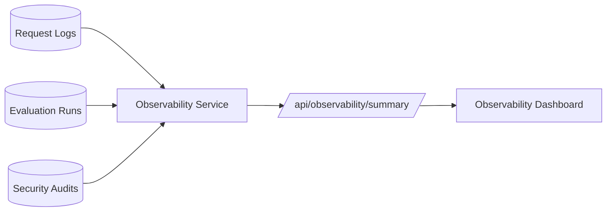

# Observability Dashboard

## Definition

The Observability Dashboard summarizes operational data from request logs, evaluation runs, and security audit records.

## Why It Exists In Aurelia Ledger

An enterprise AI platform must be operable. Teams need to know which agents are used, how slow requests are, how often security controls trigger, and whether recent evaluation runs pass.

## Implementation Links

| Area | File | Lines | Why It Matters |
| --- | --- | --- | --- |
| Summary service | [observability_service.py](https://github.com/WWIIITT/enterprise-financial-intelligence-agent/blob/main/backend/app/services/observability_service.py#L19-L81) | L19-L81 | Aggregates logs, eval runs, and security audits |
| Empty-state response | [observability_service.py](https://github.com/WWIIITT/enterprise-financial-intelligence-agent/blob/main/backend/app/services/observability_service.py#L82-L97) | L82-L97 | Keeps dashboard stable when DB is empty |
| Distribution and p95 helpers | [observability_service.py](https://github.com/WWIIITT/enterprise-financial-intelligence-agent/blob/main/backend/app/services/observability_service.py#L98-L128) | L98-L128 | Computes route shares and latency percentiles |
| Request log model | [models.py](https://github.com/WWIIITT/enterprise-financial-intelligence-agent/blob/main/backend/app/models.py#L38-L49) | L38-L49 | Stores agent, latency, sources, and cost |
| Evaluation run model | [models.py](https://github.com/WWIIITT/enterprise-financial-intelligence-agent/blob/main/backend/app/models.py#L94-L104) | L94-L104 | Stores eval summary history |
| Observability eval cases | [observability_cases.json](https://github.com/WWIIITT/enterprise-financial-intelligence-agent/blob/main/backend/app/evals/observability_cases.json) | Full file | Validates summary endpoint behavior |

## Core Workflow



## Technical Deep Dive

The dashboard uses PostgreSQL logs already created by the platform. It avoids Prometheus and Grafana for the MVP, but still shows operational health signals.

The service must handle empty states. A fresh database should return zeros and empty arrays instead of breaking the UI.

## Formula / Scoring Model

Average latency:

```text
latency_avg_ms = sum(latency_ms) / request_count
```

P95 latency:

```text
p95 = sorted(latencies)[ceil(0.95 * n) - 1]
```

Route share:

```text
route_share(agent) = count(agent) / total_requests
```

Security action share:

```text
action_share(action) = count(action) / total_security_events
```

## Example Walkthrough

Request:

```powershell
Invoke-RestMethod http://localhost:8000/api/observability/summary
```

Expected response includes:

- request count
- average latency
- p95 latency
- agent route distribution
- latest evaluation pass rate
- security action distribution
- recent requests

## Design Tradeoffs

- PostgreSQL summary is simple and low-friction.
- Dedicated metrics infrastructure would be stronger for production.
- Compact UI avoids adding a charting dependency.

## Failure Modes

- Logs grow without retention policy.
- PostgreSQL is not optimized as a high-volume metrics store.
- Averages can hide outliers, so p95 is included.

## Exercises

1. Checkpoint:
   Explain why p95 latency is more useful than only average latency.

2. Hands-on:
   Inspect [observability_service.py L98-L128](https://github.com/WWIIITT/enterprise-financial-intelligence-agent/blob/main/backend/app/services/observability_service.py#L98-L128) and explain distribution and percentile calculation.

3. Interview Drill:
   Explain why observability changes the project from a chatbot demo into an operable system.

## Interview Explanation

Observability provides the operational evidence behind the agent system. It shows what the platform did, not just what answer appeared in the UI.
