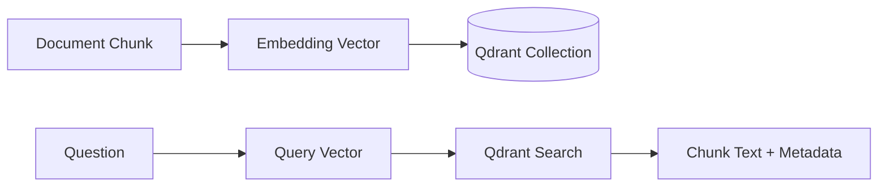

# Qdrant Vector Retrieval

## Definition

Qdrant is the vector database used to store embedded document chunks and retrieve semantically similar evidence for a user query.

## Why It Exists In Aurelia Ledger

The platform needs persistent retrieval across backend restarts. Qdrant makes the project closer to a production RAG architecture than an in-memory search demo.

## Implementation Links

| Area | File | Lines | Why It Matters |
| --- | --- | --- | --- |
| Qdrant store class | [vector_store.py](https://github.com/WWIIITT/enterprise-financial-intelligence-agent/blob/main/backend/app/rag/vector_store.py#L18-L145) | L18-L145 | Handles Qdrant upsert and search |
| Collection validation | [vector_store.py](https://github.com/WWIIITT/enterprise-financial-intelligence-agent/blob/main/backend/app/rag/vector_store.py#L157-L185) | L157-L185 | Prevents embedding dimension mismatch |
| Embedding client | [embedding_client.py](https://github.com/WWIIITT/enterprise-financial-intelligence-agent/blob/main/backend/app/rag/embedding_client.py#L16-L84) | L16-L84 | Calls OpenAI-compatible embedding providers |
| Local fallback store | [store.py](https://github.com/WWIIITT/enterprise-financial-intelligence-agent/blob/main/backend/app/rag/store.py#L11-L86) | L11-L86 | Provides deterministic test/dev retrieval behavior |
| Embedding tests | [test_embedding_client.py](https://github.com/WWIIITT/enterprise-financial-intelligence-agent/blob/main/backend/tests/test_embedding_client.py) | Full file | Validates embedding configuration and provider behavior |

## Core Workflow



## Technical Deep Dive

Each chunk is stored with a vector and metadata payload. The payload is as important as the vector because it contains title, citation, source type, URL, and section information. Retrieval returns both similarity scores and metadata needed for grounded answers.

Collection validation is critical. If a collection was created with a 1536-dimensional embedding model and a later request uses a 1024-dimensional model, search quality and upsert behavior become invalid. The system detects this mismatch instead of silently mixing vectors.

## Formula / Scoring Model

Vector databases rank by similarity:

```text
top_k = highest_similarity(query_vector, chunk_vectors)
```

Dimension compatibility:

```text
valid_collection = existing_vector_size == embedding_vector_size
```

If this check fails, the correct action is to reset or recreate the collection and re-ingest documents.

## Example Walkthrough

When policy documents are ingested:

1. Markdown is loaded from `data/policies/`.
2. Text is chunked.
3. Provider embeddings are generated.
4. Chunks are upserted into Qdrant.
5. Chat queries search Qdrant and return chunk payloads as sources.

## Design Tradeoffs

- Provider embeddings improve semantic retrieval but require API configuration.
- Qdrant persistence improves realism but introduces collection lifecycle issues.
- Local fallback supports tests but should not be mistaken for production retrieval.

## Failure Modes

- Missing `EMBEDDING_MODEL`.
- Provider does not support `/embeddings`.
- Qdrant collection dimension mismatch.
- Payload metadata missing citation fields.

## Exercises

1. Checkpoint:
   Explain why vector dimension mismatch is dangerous in a persistent vector database.

2. Hands-on:
   Inspect [vector_store.py L157-L185](https://github.com/WWIIITT/enterprise-financial-intelligence-agent/blob/main/backend/app/rag/vector_store.py#L157-L185) and describe how collection validation works.

3. Interview Drill:
   Explain why Qdrant is a better portfolio signal than only using an in-memory Python list.

## Interview Explanation

Qdrant is used because production RAG needs durable vector search, metadata payloads, and explicit collection validation.
