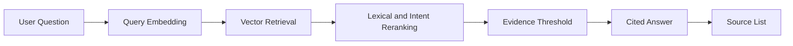

# RAG And Citations

## Definition

Retrieval-Augmented Generation, or RAG, answers a question by retrieving relevant source text before composing a response. In Aurelia Ledger, RAG is citation-aware: every useful answer should expose the source chunks that support it.

## Why It Exists In Aurelia Ledger

Financial and compliance answers need evidence. A fluent answer is not enough if it cannot point back to SEC filings or internal policy documents. This module demonstrates how to make source grounding visible through the API and UI.

## Implementation Links

| Area | File | Lines | Why It Matters |
| --- | --- | --- | --- |
| RAG response entrypoint | [rag_service.py](https://github.com/WWIIITT/enterprise-financial-intelligence-agent/blob/main/backend/app/services/rag_service.py#L16-L84) | L16-L84 | Builds citation-aware chat responses from retrieved evidence |
| Retrieval and reranking | [rag_service.py](https://github.com/WWIIITT/enterprise-financial-intelligence-agent/blob/main/backend/app/services/rag_service.py#L132-L186) | L132-L186 | Retrieves Qdrant candidates and applies lightweight reranking |
| Evidence threshold | [rag_service.py](https://github.com/WWIIITT/enterprise-financial-intelligence-agent/blob/main/backend/app/services/rag_service.py#L187-L228) | L187-L228 | Decides when evidence is strong enough to answer |
| Answer synthesis | [rag_service.py](https://github.com/WWIIITT/enterprise-financial-intelligence-agent/blob/main/backend/app/services/rag_service.py#L238-L320) | L238-L320 | Builds deterministic grounded answers and SEC risk summaries |
| Chunking | [chunking.py](https://github.com/WWIIITT/enterprise-financial-intelligence-agent/blob/main/backend/app/rag/chunking.py#L5-L24) | L5-L24 | Splits long documents into overlapping text chunks |
| Retrieval tests | [test_retrieval.py](https://github.com/WWIIITT/enterprise-financial-intelligence-agent/blob/main/backend/tests/test_retrieval.py) | Full file | Verifies retrieval and no-answer behavior |

## Core Workflow



## Technical Deep Dive

The RAG path combines semantic retrieval and deterministic safeguards:

- Semantic retrieval finds chunks close to the query embedding.
- Lightweight reranking boosts chunks with lexical overlap and source intent.
- Source intent prevents policy chunks from dominating company-risk questions.
- Evidence thresholds avoid forcing answers when retrieved chunks are weak.
- Final answers include `answer`, `agent`, `sources`, `trace`, and `metrics`.

This is intentionally conservative. The system would rather return a limited or no-answer response than invent a financial claim.

## Formula / Scoring Model

Cosine similarity is the core vector retrieval intuition:

```text
cosine_similarity(q, d) = (q · d) / (||q|| * ||d||)
```

Lightweight reranking can be understood as:

```text
final_score = vector_score + lexical_overlap_bonus + source_intent_bonus + section_intent_bonus
```

Evidence gate:

```text
answer_allowed = top_vector_score >= MIN_VECTOR_SCORE
              or lexical_score >= MIN_LEXICAL_SCORE
```

## Example Walkthrough

Question:

```text
What does the AI Usage Policy say about approved use?
```

Expected behavior:

1. The query routes to policy RAG.
2. Policy chunks are retrieved from Qdrant.
3. The answer summarizes approved use rules.
4. Sources include policy markdown citations.
5. Trace shows receive, route, policy compliance, and respond.

## Design Tradeoffs

- Deterministic synthesis reduces hallucination risk and cost.
- Citation formatting is easier to evaluate than free-form answer generation.
- Rule-based reranking is transparent but less flexible than learned reranking.

## Failure Modes

- Weak retrieval can surface unrelated chunks.
- Chunk size can lose context or dilute relevance.
- Source metadata can be incomplete.
- Reranking rules need updates as new document types are added.

## Exercises

1. Checkpoint:
   Explain why citation-aware answers matter more in financial research than in casual Q&A.

2. Hands-on:
   Inspect [rag_service.py L187-L228](https://github.com/WWIIITT/enterprise-financial-intelligence-agent/blob/main/backend/app/services/rag_service.py#L187-L228) and identify how evidence strength is checked.

3. Interview Drill:
   Explain why this project uses deterministic answer synthesis for MVP RAG instead of fully generative LLM synthesis.

## Interview Explanation

The project treats citations as a product requirement, not a visual feature. In financial AI, the user must know which filing or policy supports each claim.
