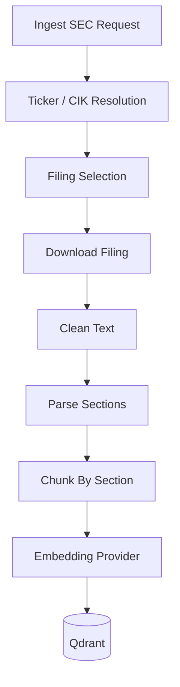

# SEC EDGAR Ingestion

## Definition

SEC EDGAR ingestion downloads public company filings, cleans filing text, parses filing sections, chunks the content, and indexes it for citation-aware document research.

## Why It Exists In Aurelia Ledger

SEC filings are primary-source evidence for company risk, business strategy, market risk, and management discussion. A financial intelligence platform should work with real filings, not only curated sample documents.

## Implementation Links

| Area | File | Lines | Why It Matters |
| --- | --- | --- | --- |
| SEC models and fetch entrypoint | [sec_edgar_client.py](https://github.com/WWIIITT/enterprise-financial-intelligence-agent/blob/main/backend/app/services/sec_edgar_client.py#L23-L102) | L23-L102 | Resolves and downloads target filing |
| Filing cleaning and parser | [sec_edgar_client.py](https://github.com/WWIIITT/enterprise-financial-intelligence-agent/blob/main/backend/app/services/sec_edgar_client.py#L103-L159) | L103-L159 | Cleans HTML and extracts filing sections |
| Filing selection | [sec_edgar_client.py](https://github.com/WWIIITT/enterprise-financial-intelligence-agent/blob/main/backend/app/services/sec_edgar_client.py#L160-L223) | L160-L223 | Selects ticker, CIK, year, form, or accession |
| SEC retry / throttling | [sec_edgar_client.py](https://github.com/WWIIITT/enterprise-financial-intelligence-agent/blob/main/backend/app/services/sec_edgar_client.py#L231-L291) | L231-L291 | Handles SEC request reliability |
| Live SEC ingestion | [ingestion_service.py](https://github.com/WWIIITT/enterprise-financial-intelligence-agent/blob/main/backend/app/services/ingestion_service.py#L53-L124) | L53-L124 | Converts live filing into indexed chunks |
| SEC eval cases | [sec_filing_cases.json](https://github.com/WWIIITT/enterprise-financial-intelligence-agent/blob/main/backend/app/evals/sec_filing_cases.json) | Full file | Validates SEC behavior |

## Core Workflow



## Technical Deep Dive

The SEC ingestion path solves three practical problems:

- Filing selection: users may ask for latest filing, specific year, or specific accession number.
- Text extraction: SEC HTML is noisy, so content must be cleaned and common mojibake repaired.
- Citation quality: chunks keep form type, filing date, accession number, URL, and section name.

The parser does not attempt to fully understand every SEC HTML layout. It focuses on stable section boundaries such as `Item 1A. Risk Factors` and `Item 7. Management's Discussion and Analysis`.

## Formula / Scoring Model

Filing selection priority:

```text
target_filing =
  accession_number match
  else filing_year + form_type match
  else latest form_type match
```

Citation shape:

```text
{ticker} {form_type} {filing_date} {accession_number} {section} chunk {n}
```

## Example Walkthrough

Request:

```json
{
  "source": "edgar",
  "ticker": "AAPL",
  "form_type": "10-K",
  "filing_year": 2025
}
```

Expected behavior:

1. Resolve AAPL to CIK.
2. Select the 2025 10-K.
3. Download the filing.
4. Parse section boundaries.
5. Index chunks in Qdrant.
6. Answer Apple risk questions using SEC filing citations.

## Design Tradeoffs

- Deterministic section parsing is transparent and testable.
- Retry and throttling keep SEC access polite.
- The MVP parser is not a full SEC filing semantic parser.

## Failure Modes

- Missing `SEC_USER_AGENT`.
- SEC rate limiting or temporary failure.
- Filing section heading does not match expected patterns.
- Risk question retrieves general filing text rather than Risk Factors.

## Exercises

1. Checkpoint:
   Explain why SEC filings are stronger evidence than general web summaries for company risk analysis.

2. Hands-on:
   Inspect [sec_edgar_client.py L175-L223](https://github.com/WWIIITT/enterprise-financial-intelligence-agent/blob/main/backend/app/services/sec_edgar_client.py#L175-L223) and identify the filing selection logic.

3. Interview Drill:
   Explain how section-aware citation improves trust in SEC filing RAG.

## Interview Explanation

The SEC connector proves the platform can ingest real regulatory documents and preserve enough metadata for traceable financial research.
