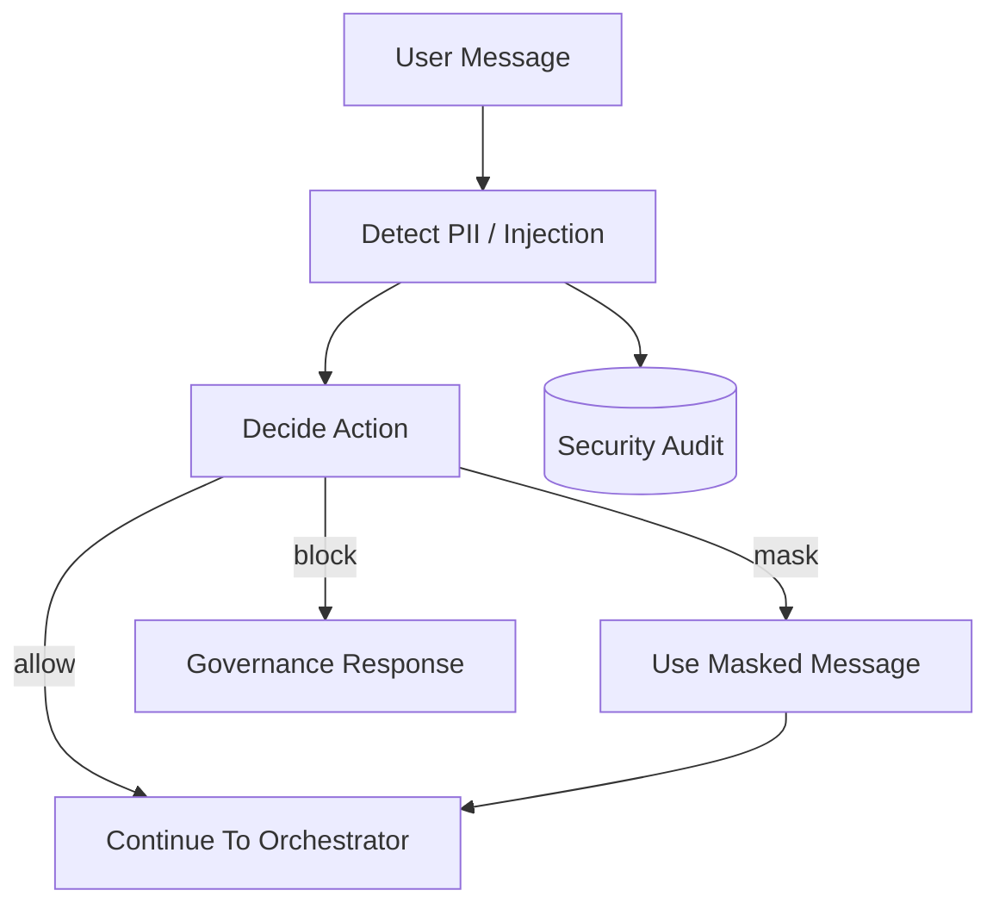

# Security Governance

## Definition

Security governance is the preflight layer that detects sensitive input, masks PII, blocks prompt injection, and writes audit records without storing raw sensitive text.

## Why It Exists In Aurelia Ledger

Financial enterprise AI must handle confidential data and adversarial prompts before retrieval or tool use. Unsafe requests should not reach downstream agents.

## Implementation Links

| Area | File | Lines | Why It Matters |
| --- | --- | --- | --- |
| Detection patterns | [security_service.py](https://github.com/WWIIITT/enterprise-financial-intelligence-agent/blob/main/backend/app/services/security_service.py#L10-L27) | L10-L27 | Defines PII and secret-like patterns |
| Security check entrypoint | [security_service.py](https://github.com/WWIIITT/enterprise-financial-intelligence-agent/blob/main/backend/app/services/security_service.py#L28-L71) | L28-L71 | Runs mask/block logic and audit logging |
| Block response and hashing | [security_service.py](https://github.com/WWIIITT/enterprise-financial-intelligence-agent/blob/main/backend/app/services/security_service.py#L72-L86) | L72-L86 | Builds governance response and hashes messages |
| PII and injection detection | [security_service.py](https://github.com/WWIIITT/enterprise-financial-intelligence-agent/blob/main/backend/app/services/security_service.py#L87-L127) | L87-L127 | Masks PII and detects prompt injection |
| Action and risk mapping | [security_service.py](https://github.com/WWIIITT/enterprise-financial-intelligence-agent/blob/main/backend/app/services/security_service.py#L128-L147) | L128-L147 | Maps findings to allow, mask, or block |
| Audit table | [models.py](https://github.com/WWIIITT/enterprise-financial-intelligence-agent/blob/main/backend/app/models.py#L50-L62) | L50-L62 | Stores message hash and governance metadata |

## Core Workflow



## Technical Deep Dive

The security layer is deterministic. It does not call an LLM moderation API. This keeps latency low and behavior predictable.

The system masks medium-risk sensitive data and blocks high-risk prompt-injection patterns. Audit records store message hashes, not raw sensitive messages.

## Formula / Scoring Model

Risk-action mapping:

```text
if prompt_injection_detected:
    action = block
elif pii_detected:
    action = mask
else:
    action = allow
```

Message hash:

```text
message_hash = SHA256(raw_message)
```

Audit record:

```text
audit = { message_hash, risk_level, action, finding_count, agent, created_at }
```

## Example Walkthrough

Input:

```text
Contact analyst at test@example.com about Apple risk
```

Expected behavior:

1. Email pattern is detected.
2. Risk level becomes medium.
3. Action becomes `mask`.
4. Message becomes `Contact analyst at [EMAIL] about Apple risk`.
5. Masked message continues to routing.

## Design Tradeoffs

- Rule-based detection is transparent and fast.
- It does not replace enterprise DLP.
- False positives and false negatives are possible.

## Failure Modes

- Sophisticated prompt injection may bypass patterns.
- Legitimate text may be blocked if it resembles a secret.
- Role-based permissions are not fully implemented yet.

## Exercises

1. Checkpoint:
   Explain why security preflight should run before retrieval.

2. Hands-on:
   Inspect [security_service.py L128-L147](https://github.com/WWIIITT/enterprise-financial-intelligence-agent/blob/main/backend/app/services/security_service.py#L128-L147) and describe the action decision logic.

3. Interview Drill:
   Explain why audit logs store message hashes instead of raw messages.

## Interview Explanation

Security is part of the workflow, not a separate afterthought. The platform checks input before any downstream agent or retrieval tool can act on it.
