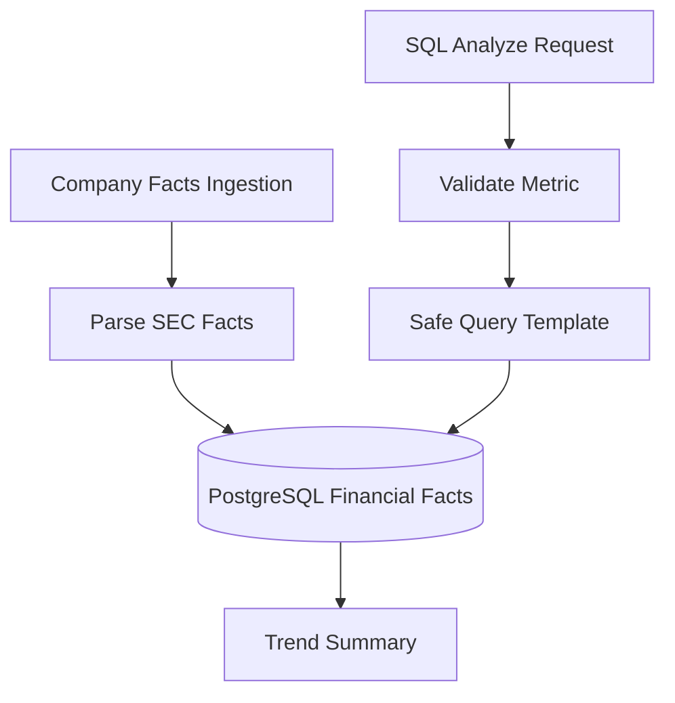

# SQL Analytics Agent

## Definition

The SQL Analytics Agent answers structured financial metric questions using safe query templates over PostgreSQL financial facts.

## Why It Exists In Aurelia Ledger

RAG is not the right tool for every question. Revenue trends, net income, assets, liabilities, cash, operating cash flow, and shares are structured facts that should be queried deterministically.

## Implementation Links

| Area | File | Lines | Why It Matters |
| --- | --- | --- | --- |
| Metric whitelist | [sql_analytics_service.py](https://github.com/WWIIITT/enterprise-financial-intelligence-agent/blob/main/backend/app/services/sql_analytics_service.py#L27-L67) | L27-L67 | Defines supported metrics and sample facts |
| Ingestion and analysis entrypoints | [sql_analytics_service.py](https://github.com/WWIIITT/enterprise-financial-intelligence-agent/blob/main/backend/app/services/sql_analytics_service.py#L95-L154) | L95-L154 | Ingests SEC facts and serves SQL analytics |
| SEC facts parsing | [sql_analytics_service.py](https://github.com/WWIIITT/enterprise-financial-intelligence-agent/blob/main/backend/app/services/sql_analytics_service.py#L155-L196) | L155-L196 | Converts SEC Company Facts payloads into internal facts |
| Persistence and query templates | [sql_analytics_service.py](https://github.com/WWIIITT/enterprise-financial-intelligence-agent/blob/main/backend/app/services/sql_analytics_service.py#L197-L260) | L197-L260 | Saves and loads financial facts safely |
| Answer and intent helpers | [sql_analytics_service.py](https://github.com/WWIIITT/enterprise-financial-intelligence-agent/blob/main/backend/app/services/sql_analytics_service.py#L261-L349) | L261-L349 | Builds deterministic SQL analytics answers and routes |
| Financial facts model | [models.py](https://github.com/WWIIITT/enterprise-financial-intelligence-agent/blob/main/backend/app/models.py#L74-L93) | L74-L93 | Defines persisted structured fact schema |

## Core Workflow



## Technical Deep Dive

The SQL agent avoids raw SQL and LLM-generated SQL. It maps user intent to a predefined metric and uses controlled SQLAlchemy queries. This design is deliberately less flexible but much safer for an enterprise MVP.

The same API can use live SEC Company Facts or deterministic sample facts, which keeps the demo path reliable.

## Formula / Scoring Model

Metric whitelist:

```text
allowed_metric = metric in METRIC_CONCEPTS
```

Trend:

```text
trend = up      if latest_value > earliest_value
trend = down    if latest_value < earliest_value
trend = flat    otherwise
```

Year-over-year change:

```text
yoy_change = ((current_year_value - prior_year_value) / abs(prior_year_value)) * 100
```

## Example Walkthrough

Request:

```json
{
  "ticker": "AAPL",
  "metric": "revenue",
  "period": "annual",
  "limit": 5
}
```

Expected behavior:

1. Validate `revenue` against the metric whitelist.
2. Query annual AAPL facts from PostgreSQL.
3. Sort by fiscal year and filing date.
4. Summarize latest value and trend.
5. Return SEC Company Facts citations.

## Design Tradeoffs

- Safe templates reduce SQL injection risk.
- Deterministic output is easier to evaluate.
- The MVP supports fewer free-form analytical questions than LLM-generated SQL.

## Failure Modes

- Unsupported metric.
- Company facts not ingested.
- Duplicate facts for the same fiscal year.
- SEC concept mapping differs by company.

## Exercises

1. Checkpoint:
   Explain why raw SQL input is not accepted in this platform.

2. Hands-on:
   Inspect [sql_analytics_service.py L27-L67](https://github.com/WWIIITT/enterprise-financial-intelligence-agent/blob/main/backend/app/services/sql_analytics_service.py#L27-L67) and identify the supported metric concepts.

3. Interview Drill:
   Explain why deterministic SQL templates are safer than LLM-generated SQL for this MVP.

## Interview Explanation

The SQL Analytics Agent shows that the platform can choose the right data access pattern: RAG for documents, SQL for structured facts.
