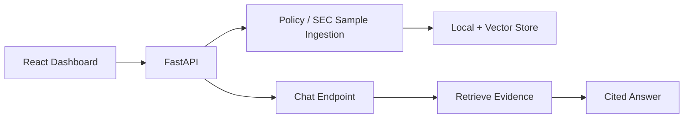

# Sprint 1: RAG MVP Foundation

## Goal

Build the smallest useful platform slice: FastAPI, Docker services, policy ingestion, sample SEC ingestion, citation-shaped RAG answers, and a React dashboard.

## Why This Sprint Matters

The project starts with retrieval and evidence before agent orchestration. In a financial setting, unsupported answers are more damaging than limited answers. Sprint 1 proves the platform can ingest documents, retrieve evidence, and show sources.

## What Was Built

- FastAPI backend with health, config, ingestion, and chat endpoints
- Docker Compose for PostgreSQL, Qdrant, and Redis
- Local policy documents for enterprise governance examples
- Basic document chunking and citation-shaped responses
- React dashboard with chat, sources, trace, metrics, and system status

## Architecture / Workflow



## Key Files And APIs

- `backend/app/api/routes.py`
- `backend/app/services/ingestion_service.py`
- `backend/app/services/rag_service.py`
- `POST /api/ingest/policy`
- `POST /api/ingest/sec`
- `POST /api/chat`

## Validation Commands

```powershell
.\.venv\Scripts\python -m pytest
cd frontend
npm run build
```

## Demo Talking Points

Explain that the MVP intentionally avoids complex agents until retrieval and citations are stable. The first credibility signal is evidence-backed answering.

## What Changed From Previous Sprint

This is the foundation sprint. It establishes the repo structure, running services, backend API, and dashboard.
