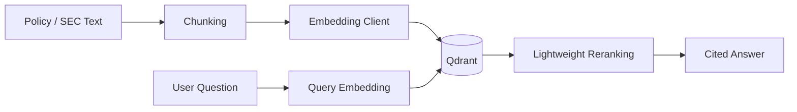

# Sprint 2: Real Embeddings And Persistent Qdrant Retrieval

## Goal

Replace development hash embeddings with provider embeddings and make Qdrant the primary retrieval backend.

## Why This Sprint Matters

RAG quality depends on embedding quality and persistent retrieval. A demo-only in-memory fallback is useful for tests, but a portfolio-grade system needs durable vector indexing, clear configuration errors, and repeatable retrieval behavior.

## What Was Built

- OpenAI-compatible embedding client
- `EMBEDDING_MODEL`, `EMBEDDING_API_KEY`, and `EMBEDDING_BASE_URL` support
- Qdrant collection dimension validation
- Provider embedding ingestion for policy and SEC documents
- Lightweight reranking and low-confidence no-answer behavior

## Architecture / Workflow



## Key Files And APIs

- `backend/app/services/embedding_client.py`
- `backend/app/services/vector_store.py`
- `POST /api/ingest/policy`
- `POST /api/chat`

## Validation Commands

```powershell
docker compose -f infra\docker-compose.yml up -d
.\.venv\Scripts\python -m pytest
```

## Demo Talking Points

Mention that production-style retrieval should fail clearly when embeddings are misconfigured. Silent fallbacks can hide real deployment problems.

## What Changed From Previous Sprint

Sprint 1 had a basic retrieval shape. Sprint 2 turns retrieval into a durable vector search path backed by provider embeddings.
