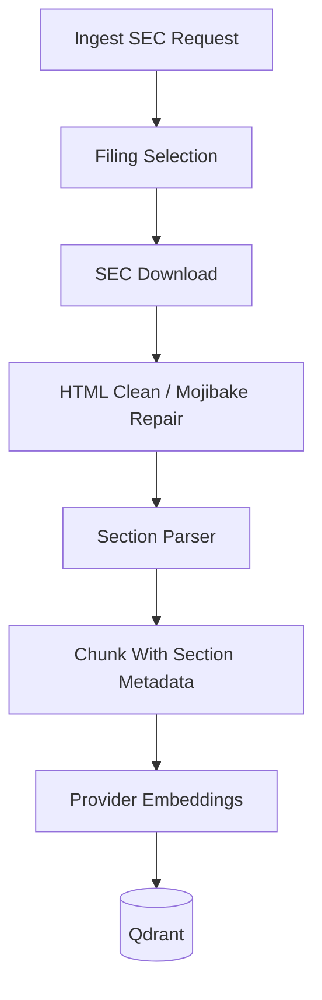

# Sprint 3: SEC EDGAR Ingestion

## Goal

Ingest real SEC filings by ticker, form type, year, or accession number, then answer filing questions with section-aware citations.

## Why This Sprint Matters

Financial intelligence requires real source documents. SEC EDGAR filings are authoritative, but they are noisy, long, and require careful parsing, throttling, and citation handling.

## What Was Built

- SEC ticker / CIK lookup
- Latest, year-based, and accession-based filing selection
- SEC request retry and throttling
- Filing HTML cleaning and section parser
- Section-aware chunk citations
- Frontend controls for live SEC ingestion
- `sec-smoke` evaluation suite

## Architecture / Workflow



## Key Files And APIs

- `backend/app/services/sec_edgar_client.py`
- `backend/app/services/sec_parser.py`
- `POST /api/ingest/sec`
- `POST /api/evals/run`

## Validation Commands

```powershell
Invoke-RestMethod -Method Post http://localhost:8000/api/ingest/sec `
  -ContentType "application/json" `
  -Body '{"source":"edgar","ticker":"AAPL","form_type":"10-K","filing_year":2025}'
```

## Demo Talking Points

Show that the platform can move beyond sample text and retrieve real SEC risk-factor evidence with accession-aware citations.

## What Changed From Previous Sprint

Sprint 2 made retrieval persistent. Sprint 3 improves the source quality by connecting to real SEC filings.
