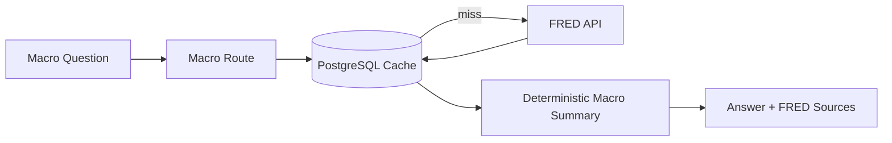

# Sprint 4: Macro Analysis Agent

## Goal

Add macroeconomic context from FRED and support macro-aware questions through a deterministic Macro Analysis Agent.

## Why This Sprint Matters

Company risk analysis often depends on external macro conditions such as rates, inflation, unemployment, GDP, and treasury yields. Sprint 4 adds a second data modality beyond documents.

## What Was Built

- FRED client with live API path
- Deterministic sample fallback when `FRED_API_KEY` is missing
- PostgreSQL macro observation cache
- `GET /api/macro/series/{series_id}`
- `POST /api/macro/analyze`
- Macro and company-plus-macro chat routing
- Frontend Macro Analysis controls
- `macro-smoke` evaluation suite

## Architecture / Workflow



## Key Files And APIs

- `backend/app/services/fred_client.py`
- `backend/app/services/macro_service.py`
- `GET /api/macro/series/{series_id}`
- `POST /api/macro/analyze`

## Validation Commands

```powershell
Invoke-RestMethod http://localhost:8000/api/macro/series/FEDFUNDS
Invoke-RestMethod -Method Post http://localhost:8000/api/evals/run `
  -ContentType "application/json" `
  -Body '{"suite":"macro-smoke"}'
```

## Demo Talking Points

Explain how the system can answer both pure macro questions and hybrid company-plus-macro questions without adding LLM cost.

## What Changed From Previous Sprint

Sprint 3 focused on company filings. Sprint 4 adds economic context and cached time-series data.
