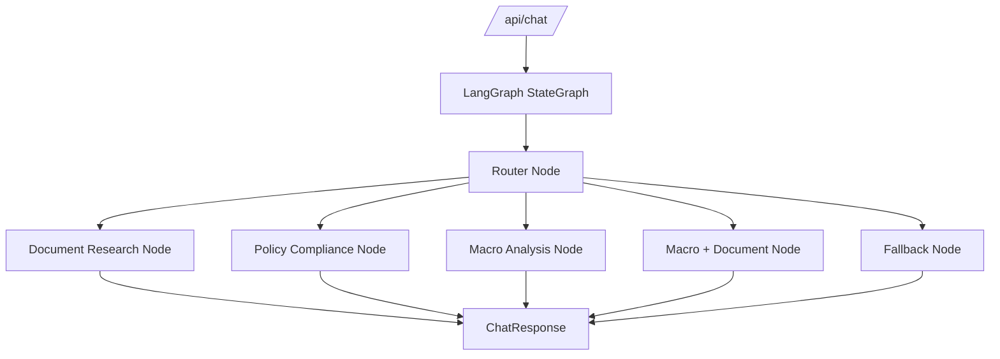

# Sprint 5: LangGraph Workflow Orchestrator

## Goal

Move `/api/chat` behind a LangGraph workflow while keeping the same public response shape.

## Why This Sprint Matters

As the platform grows, routing logic should live in a workflow layer rather than being scattered inside retrieval services. LangGraph gives the system an explicit graph structure and traceable agent execution.

## What Was Built

- `StateGraph` orchestrator
- Deterministic router node
- Document, policy, macro, macro-document, SQL-ready, and fallback routes
- Unified trace steps
- `orchestrator-smoke` evaluation suite

## Architecture / Workflow



## Key Files And APIs

- `backend/app/agents/orchestrator.py`
- `POST /api/chat`
- `POST /api/evals/run`

## Validation Commands

```powershell
Invoke-RestMethod -Method Post http://localhost:8000/api/evals/run `
  -ContentType "application/json" `
  -Body '{"suite":"orchestrator-smoke"}'
```

## Demo Talking Points

Show the Agent Trace panel. The important signal is not that an agent exists, but that route decisions are visible and testable.

## What Changed From Previous Sprint

Sprint 4 had macro-aware routing inside service logic. Sprint 5 makes routing a first-class workflow.
