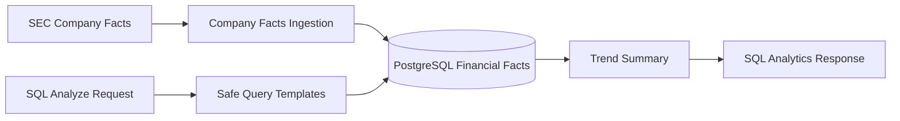

# Sprint 6: SQL Analytics Agent

## Goal

Add structured financial analytics using SEC Company Facts stored in PostgreSQL.

## Why This Sprint Matters

Not every financial question should be answered through RAG. Revenue, net income, assets, liabilities, cash, operating cash flow, and share counts are structured facts that are better queried through safe SQL templates.

## What Was Built

- Financial facts table
- SEC Company Facts client and AAPL sample fallback
- `POST /api/ingest/company-facts`
- `POST /api/sql/analyze`
- Safe metric templates with no raw SQL input
- LangGraph SQL route
- Frontend SQL Analytics controls
- `sql-smoke` evaluation suite

## Architecture / Workflow



## Key Files And APIs

- `backend/app/services/company_facts_client.py`
- `backend/app/services/sql_analytics_service.py`
- `POST /api/ingest/company-facts`
- `POST /api/sql/analyze`

## Validation Commands

```powershell
Invoke-RestMethod -Method Post http://localhost:8000/api/sql/analyze `
  -ContentType "application/json" `
  -Body '{"ticker":"AAPL","metric":"revenue","period":"annual","limit":5}'
```

## Demo Talking Points

Explain why the project avoids LLM-generated SQL in the MVP. Safe templates reduce injection risk and make evaluation deterministic.

## What Changed From Previous Sprint

Sprint 5 routed questions across agents. Sprint 6 adds a new structured-data route.
