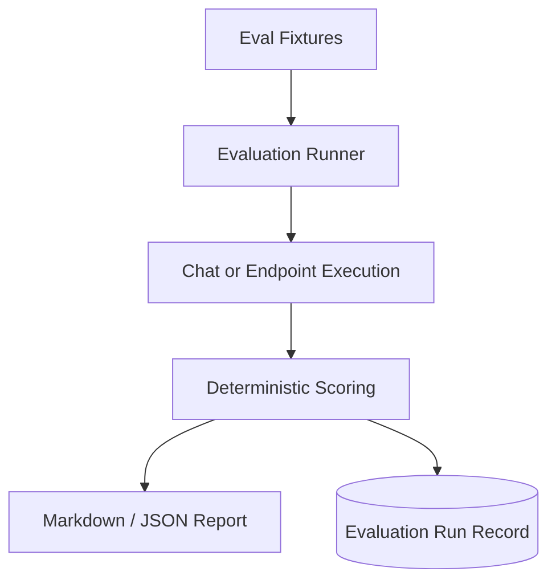

# Sprint 7: Evaluation Engine

## Goal

Turn smoke tests into a deterministic evaluation engine with scoring, reports, and persistent run records.

## Why This Sprint Matters

AI systems need measurable quality signals. Sprint 7 creates a repeatable way to evaluate route accuracy, source coverage, citation correctness, answer terms, latency, and hallucination-risk flags.

## What Was Built

- Richer evaluation case schema
- Route accuracy, citation, source, answer-term, and latency scoring
- `POST /api/evals/run`
- `POST /api/evals/report`
- Markdown and JSON reports under `data/reports/`
- Evaluation run records in PostgreSQL
- Frontend evaluation controls

## Architecture / Workflow



## Key Files And APIs

- `backend/app/services/eval_service.py`
- `backend/app/evals/*.json`
- `POST /api/evals/run`
- `POST /api/evals/report`

## Validation Commands

```powershell
Invoke-RestMethod -Method Post http://localhost:8000/api/evals/report `
  -ContentType "application/json" `
  -Body '{"suite":"all"}'
```

## Demo Talking Points

Position deterministic scoring as a portfolio MVP: low cost, repeatable, and CI-friendly. A future production version can add human review or LLM-as-judge.

## What Changed From Previous Sprint

Sprint 6 added more agent capability. Sprint 7 adds the measurement layer.
