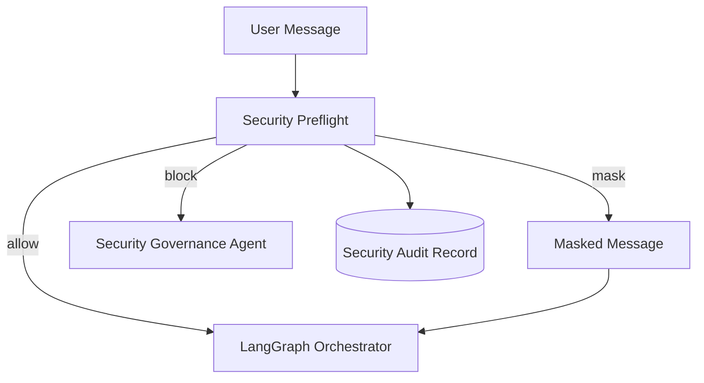

# Sprint 8: Security And Governance Guardrails

## Goal

Add deterministic security preflight checks before agent routing.

## Why This Sprint Matters

Enterprise AI systems must handle sensitive data and adversarial prompts. Sprint 8 adds safety controls without relying on an external moderation API.

## What Was Built

- Security guardrail service
- PII masking for email, phone, SSN, card-like values, and secret-like tokens
- Prompt injection blocking
- `POST /api/security/check`
- `/api/chat` security preflight
- Security audit records with message hash only
- Frontend governance controls
- `security-smoke` evaluation suite

## Architecture / Workflow



## Key Files And APIs

- `backend/app/services/security_service.py`
- `POST /api/security/check`
- `POST /api/chat`

## Validation Commands

```powershell
Invoke-RestMethod -Method Post http://localhost:8000/api/security/check `
  -ContentType "application/json" `
  -Body '{"message":"Contact analyst at test@example.com about Apple risk","role":"research_analyst"}'
```

## Demo Talking Points

Show masking and blocking. Explain that raw sensitive text is not stored in audit records.

## What Changed From Previous Sprint

Sprint 7 measured quality. Sprint 8 adds governance controls before any agent execution.
