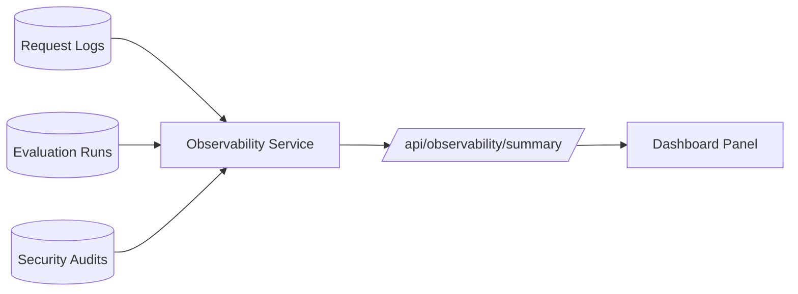

# Sprint 9: Observability Dashboard

## Goal

Create a custom monitoring layer over request logs, evaluation runs, and security audits.

## Why This Sprint Matters

Operational AI systems need visibility. Sprint 9 answers practical questions: which agents are used, how slow requests are, how many sources are returned, what the latest eval result is, and how often security actions occur.

## What Was Built

- `GET /api/observability/summary`
- Request count, average latency, p95 latency, average sources, and estimated cost
- Agent route distribution
- Recent requests
- Latest evaluation summary
- Security action distribution
- Recent security events
- Frontend Observability Dashboard
- `observability-smoke` evaluation suite

## Architecture / Workflow



## Key Files And APIs

- `backend/app/services/observability_service.py`
- `GET /api/observability/summary`

## Validation Commands

```powershell
Invoke-RestMethod http://localhost:8000/api/observability/summary
```

## Demo Talking Points

Show that the platform is not just a chatbot. It has operational telemetry that can support monitoring, debugging, and portfolio review.

## What Changed From Previous Sprint

Sprint 8 added governance events. Sprint 9 aggregates operational events into a dashboard.
