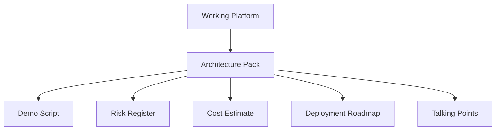

# Sprint 10: Architecture Pack And Portfolio Polish

## Goal

Package the engineering work into a portfolio-ready architecture story.

## Why This Sprint Matters

Senior roles require more than implementation. Sprint 10 explains business context, tradeoffs, risks, cost, deployment, security, demo flow, and interview positioning.

## What Was Built

- Architecture pack
- Risk register
- Cost estimate
- Deployment roadmap
- Security and governance document
- Demo script
- Interview talking points
- README portfolio deliverables section

## Architecture / Workflow



## Key Files And APIs

- `docs/architecture-pack.md`
- `docs/risk-register.md`
- `docs/cost-estimate.md`
- `docs/deployment-roadmap.md`
- `docs/demo-script.md`
- `docs/interview-talking-points.md`

## Validation Commands

```powershell
.\.venv\Scripts\python -m pytest
cd frontend
npm run build
```

## Demo Talking Points

Use the architecture pack to explain how each sprint maps to production concerns: data, agents, governance, evaluation, observability, and deployment.

## What Changed From Previous Sprint

Sprint 9 completed the monitoring layer. Sprint 10 turns the project into a coherent interview and portfolio artifact.
