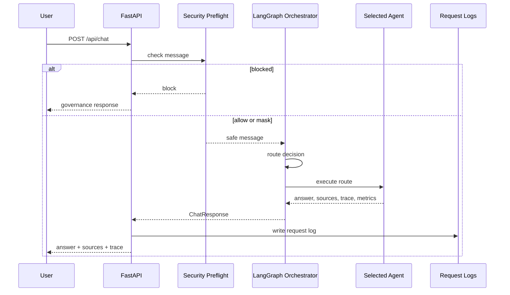

# Chat Request Lifecycle

## Purpose

This workflow explains what happens when a user sends a message to `/api/chat`.

## Flow

## Key Decisions

- Security runs before retrieval or tool access.
- The frontend response shape stays stable.
- The trace exposes route decisions and agent execution.

## What To Watch In A Demo

Use the Agent Trace panel to show `security_preflight`, `route`, selected agent step, and `respond`.
