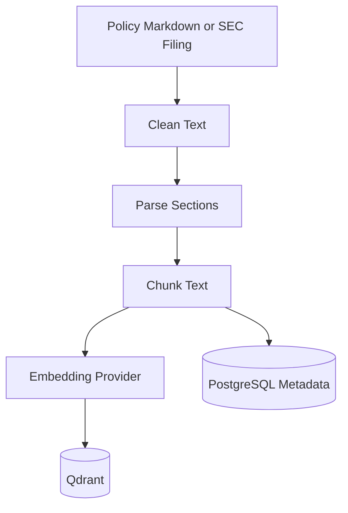

# Document Ingestion Flow

## Purpose

This workflow explains how policy documents and SEC filings become searchable RAG evidence.

## Flow

## Policy Ingestion

Policy documents live under `data/policies/`. They model internal AI usage, privacy, investment review, model risk, and client communication policies.

## SEC Ingestion

SEC filings are downloaded from EDGAR, cleaned, parsed into sections, and indexed with form type, filing date, accession number, URL, and section metadata.

## What To Watch In A Demo

Run policy ingestion, run live SEC ingestion, then ask a cited question about Apple risk or approved AI use.
