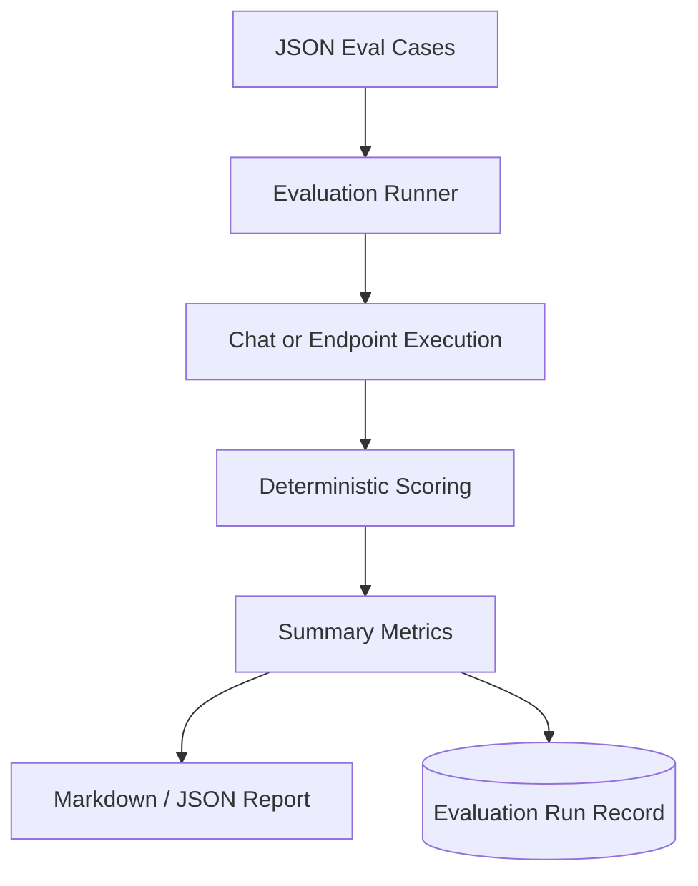

# Evaluation Reporting Flow

## Purpose

This workflow explains how evaluation suites become quality metrics and portfolio reports.

## Flow

## Metrics

- Pass rate
- Route accuracy
- Source coverage
- Citation score
- Answer term score
- Average latency
- P95 latency
- Hallucination-risk count

## What To Watch In A Demo

Generate `suite="all"` and open `data/reports/evaluation-report.md`.
