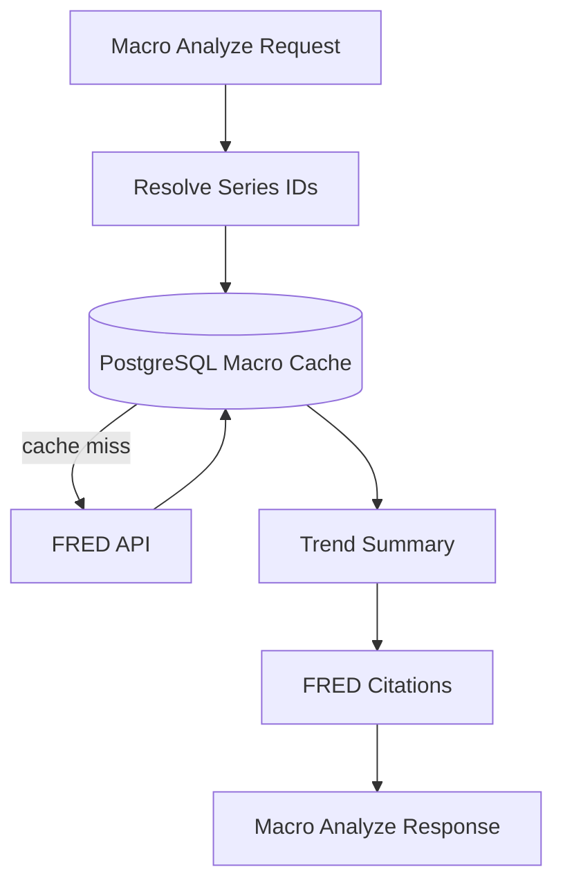

# Macro Analysis Flow

## Purpose

This workflow explains how the Macro Analysis Agent loads and summarizes FRED macroeconomic series.

## Flow

## Supported Series

- `FEDFUNDS`: Federal Funds Effective Rate
- `CPIAUCSL`: Consumer Price Index
- `UNRATE`: Unemployment Rate
- `GDP`: Gross Domestic Product
- `DGS10`: 10-Year Treasury Constant Maturity Rate

## What To Watch In A Demo

Ask: `How do interest rates affect Apple valuation risk?` The system can combine macro context with document evidence when company data exists.
