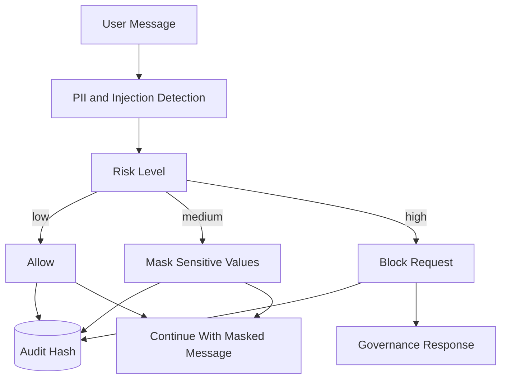

# Security Preflight Flow

## Purpose

This workflow explains how the system handles sensitive or malicious input before agent routing.

## Flow

## Current Controls

- Email, phone, SSN, card-like, and secret-like token detection
- Prompt injection and policy bypass pattern detection
- Message hash audit records

## What To Watch In A Demo

Run a standalone security check with an email address, then run a prompt injection message through `/api/chat`.
