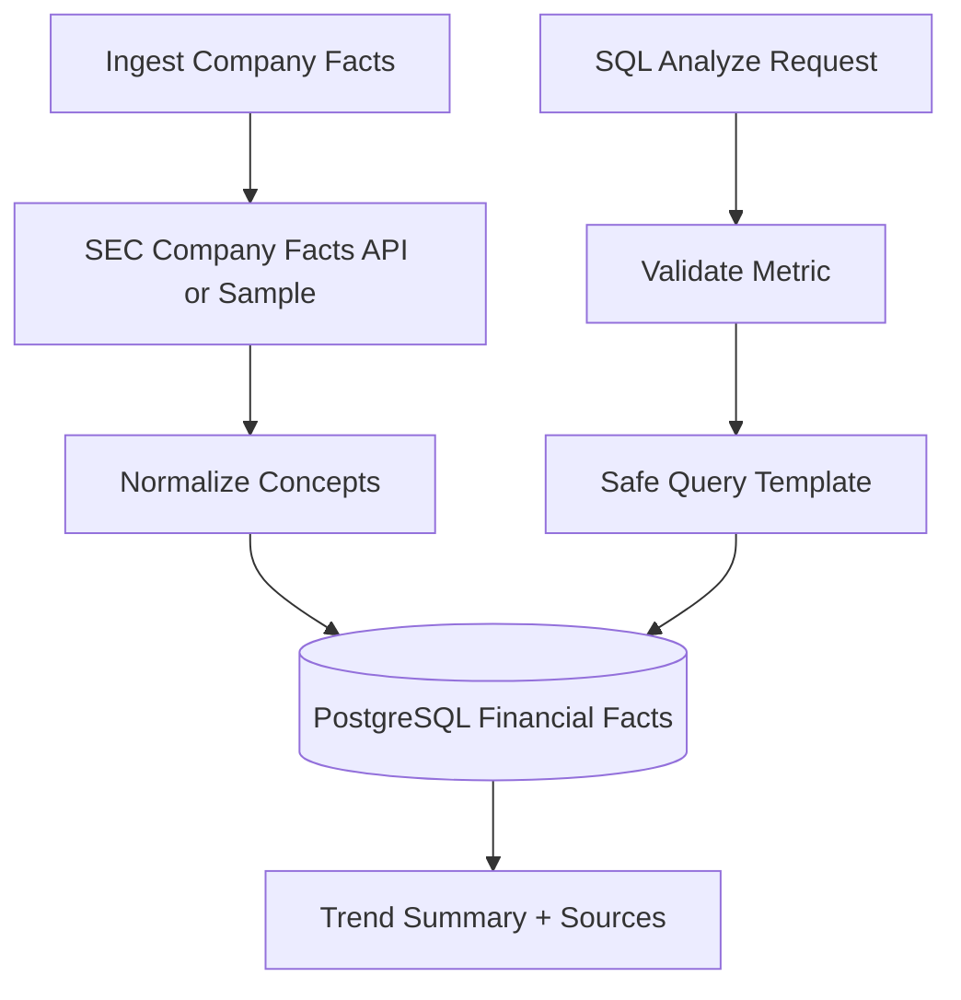

# SQL Analytics Flow

## Purpose

This workflow explains how structured financial facts are ingested and queried safely.

## Flow

## Safety Rule

The system does not accept raw SQL and does not ask an LLM to generate SQL. It only supports predefined metrics and query templates.

## What To Watch In A Demo

Run company facts ingestion for AAPL, then analyze annual revenue. The response should cite SEC Company Facts.
